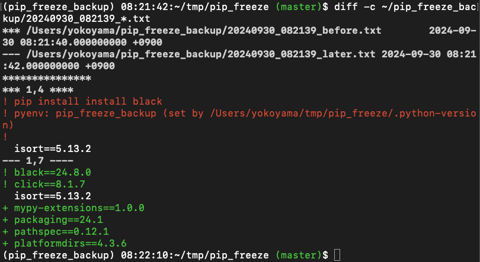

# pip Freeze Backup Script

This is a simple shell script that wraps around the `pip install` command to automatically back up the current environment's `pip freeze` output before and after the installation of packages. It helps to keep track of changes in installed packages over time by storing timestamped snapshots of your environment.



## Who is this for?

This script is ideal for Python developers who want to:
- Keep a history of their `pip freeze` snapshots for auditing or rollback purposes.
- Ensure they can track which packages were added or modified by each `pip install` operation.
- Easily integrate `pyenv` version information (if available) into their backup logs.

## Motivation

Package management with `pip` is essential, but often, there is no automatic logging of package versions before and after installations. This can create challenges when troubleshooting dependency issues or restoring previous package states. The motivation behind this tool is to:
- Provide an easy way to automatically log `pip freeze` results with timestamps.
- Support environments that use `pyenv` by logging the active Python version in the backup files.
- Avoid requiring users to remember to run additional commands before and after using `pip install`.

This tool was inspired by discussions on the need for package version tracking in this GitHub issue:

- [GitHub: pip rollback command should exist · Issue #3867 · pypa/pip](https://github.com/pypa/pip/issues/3867)

If you are interested in similar tools or issues around `pip`, this script may be useful to you.

## Setup

### Modify `.bash_profile` or `.zshrc`

In your `.bash_profile` or `.zshrc`, add the following to source the script:

```bash
# Import pip freeze backup script
if [ -f "$HOME/.pip_freeze_backup.bash" ]; then
  source "$HOME/.pip_freeze_backup.bash"
fi
```

Then, run `source ~/.bash_profile` or `source ~/.zshrc` to reload the profile.

## Usage

Once the script is set up, you can use `pip install` as usual:

```bash
pip install <package>
```

Each time you run `pip install`, the following happens:
1. A snapshot of the current environment (`pip freeze`) is saved to `${TIMESTAMP}_before.txt`.
   - The first line contains the `pip install` command.
   - The second line contains the current `pyenv` version (if available), prefixed with "pyenv: ".
   - The pip freeze output is added after a blank line.
2. The package(s) are installed.
3. Another snapshot of the environment is saved to `${TIMESTAMP}_later.txt`, containing only the `pip freeze` output.

### Example:

```bash
$ pip install requests
pip freeze (before install) backed up to /home/user/pip_freeze_backup/20240929_123456_before.txt
pip freeze (after install) backed up to /home/user/pip_freeze_backup/20240929_123456_later.txt
```

Backup files are stored in `~/pip_freeze_backup` with timestamped filenames for easy sorting.

## Notes

- **pyenv integration**: If `pyenv` is installed and available in the environment, its version is logged at the top of the `*_before.txt` backup file with the prefix "pyenv: ". This can be useful for tracking which Python version was active during the installation.
- **Pip install only**: This script specifically targets the `pip install` command. Other `pip` commands (e.g., `pip uninstall`, `pip list`) are executed without any logging.
- **Customizable**: You can modify the log directory and filename format if needed by changing the relevant variables in the script.
- **Compatibility**: This script has been tested on macOS and Linux environments but should work on any Bash-compatible system.

## Contact

For any questions or support, please reach out to [flogics.com](https://flogics.com/).
